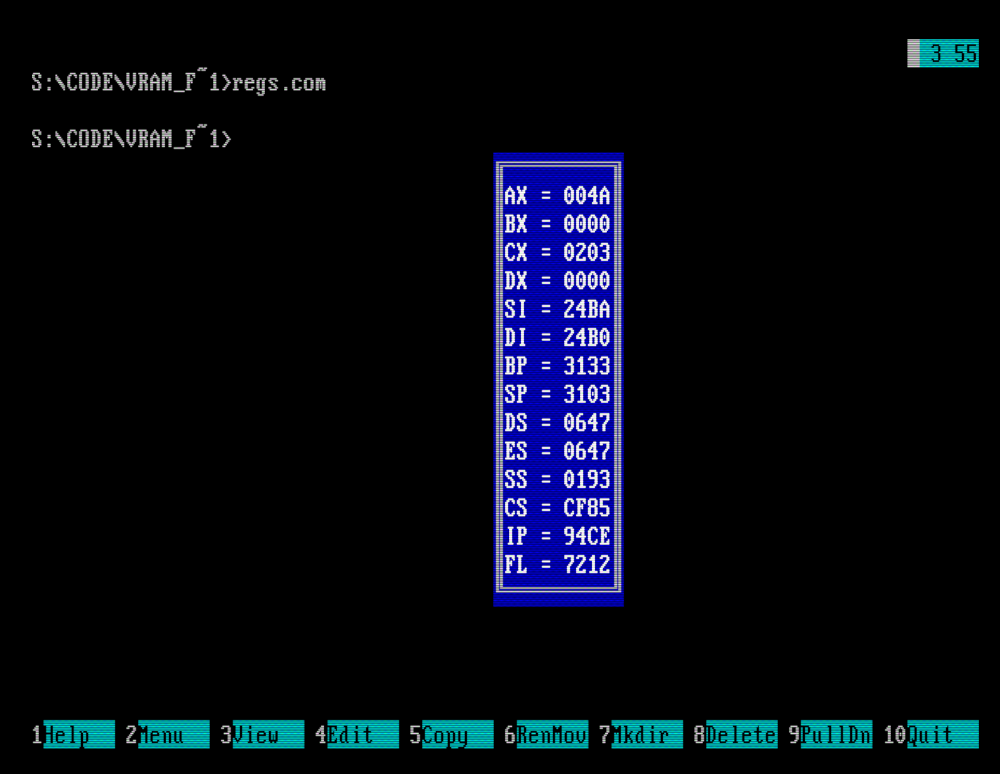
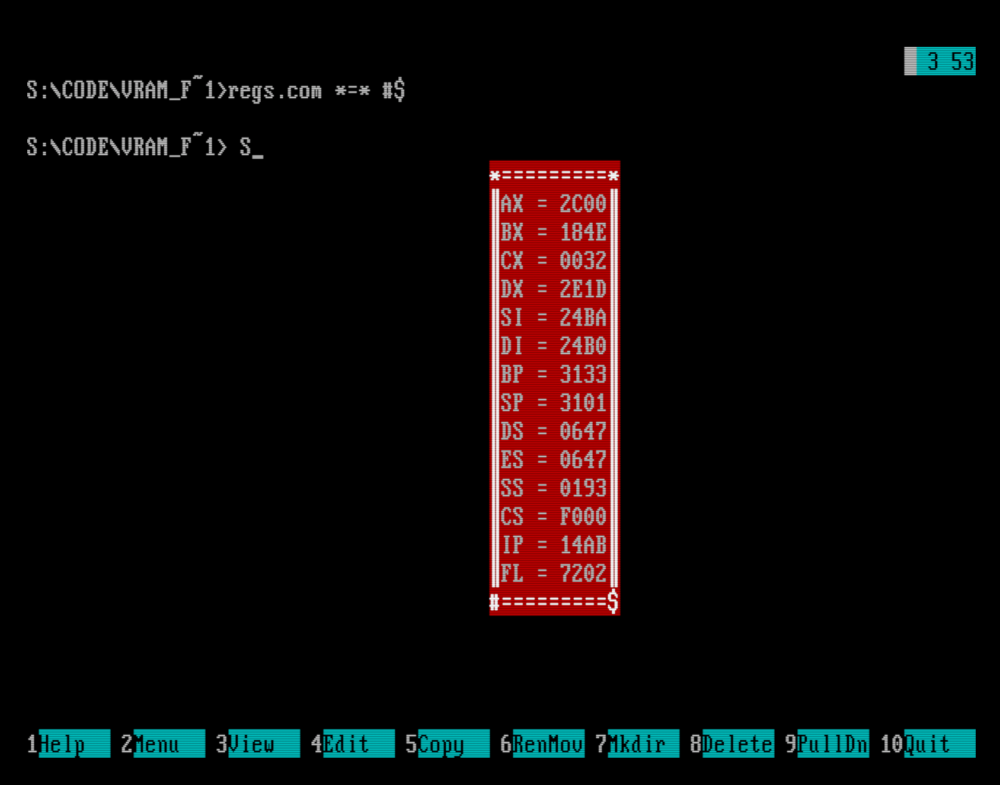

# TSR Register Dumper

TSR-утилита для DOS, написанная на 16-битном ассемблере x86. При нажатии клавиши Alt выводит дамп регистров процессора поверх текущего текстового экрана.

<p align="center">
    
    <br>
    <em>Результат запуска программы и нажатия горячей клавиши</em>
</p>


## Особенности

- Перехват аппаратного прерывания клавиатуры (int 09h)
- Одинарная буферизация окна
- Прямая работа с видеопамятью 
- Настраиваемая через аргументы командной строки рамка
- Возможность изменения характеристик дампа

## Требования

Для запуска требуется DOSBox или виртуальная машина, а также ассемблер TASM.

## Инструкция по запуску

```
regs.asm
regs.obj
```

## Как использовать

```
regs.com [1][2][3][4][5][6]
```

где [1][2][3][4][5][6] - символы рамки, которые вы, может быть, хотели бы использовать вместо стандартных. Ввод начинается строго через 1 пробел, можно пропускать любой из аргументов 1-6.
| Позиция аргумента | Описание элемента рамки | Значение по умолчанию |
| ----------------- | ----------------------- | --------------------- |
| 1                 | Левый верхний угол      | 0C9h (╔)              |
| 2                 | Горизонтальная линия    | 0CDh (═)              |
| 3                 | Правый верхний угол     | 0BBh (╗)              |
| 4                 | Вертикальная линия      | 0BAh (║)              |
| 5                 | Левый нижний угол       | 0C8h (╚)              |
| 6                 | Правый нижний угол      | 0BCh (╝)              |

### Пример
```
regs.com *=* #$
```

<p align="center">
    
    <br>
    <em>Результат запуска программы и нажатия горячей клавиши</em>
</p>

## Интересные факты

- В программе активно используются несколько способов передачи аргументов в функцию (registers, Pascal, CDecl)

- При нажатии горячей клавиши Alt 09h прерывание полностью обрабатывается вручную, поэтому другие программы не смогут использовать эту клавишу

- В некоторых функциях существует список затираемых регистров, для которых не гарантируется сохранение значения после вызова функции

- При получении значений регистров реализован красивый способ получить значения до прерывания 

